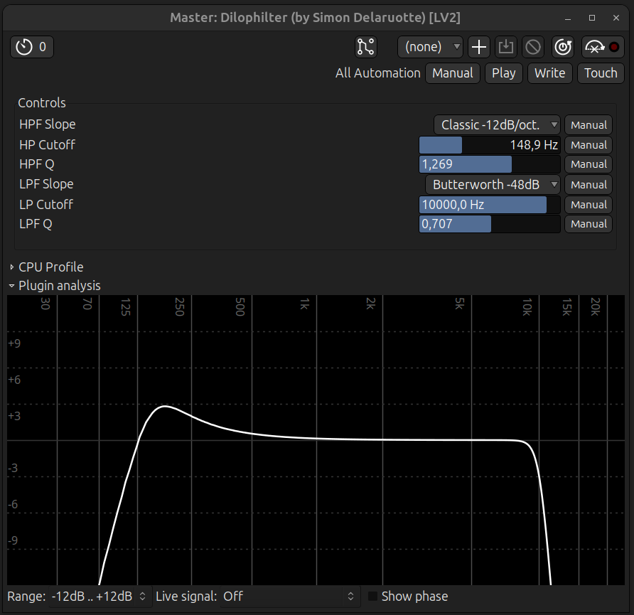

# Dilophilter LV2 Plugin
Dual filter plugin with independent high-pass and low-pass filters, designed for low CPU. Multiple slope options for Classic, Butterworth and Linkwitz-Riley filter responses.

 
*Plugin controls as displayed by Ardour's default generic UI. Your host may show controls differently. The frequency analysis graph shown below the controls is part of Ardour's plugin window, not a feature of this plugin.*

## Features

- Independent high-pass and low-pass filters
- Multiple slope options per filter :
  - Off (filter bypassed)
  - Classic -12dB/octave
  - Classic -24dB/octave
  - Classic -48dB/octave
  - Butterworth -24dB/octave
  - Butterworth -48dB/octave
  - Linkwitz-Riley -24dB/octave
  - Linkwitz-Riley -48dB/octave
  - Linkwitz-Riley -96dB/octave
- Adjustable cutoff frequency (20Hz-20kHz)
- Resonance/Q control for Classic modes (from 0.1 to 5.0)
- Butterworth and Linkwitz-Riley modes ignore resonance
- No custom GUI — uses host's generic controls
- Stereo input/output
- No dependencies beyond LV2 SDK

## Project Home

<https://simdott.github.io/dilophilter>

## Plugin URI

`urn:simdott:dilophilter`

## Dependencies

- C compiler (gcc, clang, etc.)
- LV2 development headers

### Installation by distribution

**Debian/Ubuntu** :
sudo apt-get install build-essential lv2-dev

**Fedora** :
sudo dnf install gcc lv2-devel

**Arch** :
sudo pacman -S base-devel lv2

## Build and Install

1. Download the source :
   git clone https://github.com/simdott/dilophilter
   cd dilophilter

2. Install for current user (recommended) :
   sh install.sh
   
   Or install system-wide (requires sudo) :
   sudo sh install.sh

## Verification

List installed plugins :
lv2ls | grep dilophilter

Should show : `urn:simdott:dilophilter`

## Usage

Load in any LV2-compatible host (Ardour, Carla, Reaper, etc.). Connect stereo inputs/outputs. 

Each filter operates independently :

- **High-Pass Filter (HPF)** : Use Slope, Cutoff, and Q controls to shape the low end
- **Low-Pass Filter (LPF)** : Use Slope, Cutoff, and Q controls to shape the high end

**Classic modes** : Resonance (Q) shapes the filter's response at the cutoff frequency ;
- **Low Q values (<0.707)** : Gentle, broad filter
- **Q=0.707** : Standard flat response
- **High Q values (>0.707)** : Resonant peak, more pronounced as Q increases

**Butterworth modes** : Provide flat passband response. Individual low-pass and high-pass outputs are -3dB at cutoff. **Q control has no effect in these modes**.

**Linkwitz-Riley modes** : Provide flat summed response for crossover applications. Individual low-pass and high-pass outputs are -6dB at cutoff. **Q control has no effect**.

**To bypass a filter** : Set its Slope control to "Off".

**Interface** : this plugin has no custom graphical interface. It uses your host's standard control UI (slider, knob, or numerical entry).

**Note for Carla Users** : the cutoff frequency and the resonance/Q controls use the LV2 `pprops:logarithmic` hint for logarithmic scaling. This works in Ardour and most hosts, but Carla currently displays these controls linearly. This is a host implementation difference, not a plugin issue.
If precise logarithmic control in Carla is important to you, please let me know by opening an issue — this helps me prioritize a custom GUI in the future.

## Technical Notes
All filters implemented as IIR biquad cascades.
Designed for minimal CPU usage (no oversampling and phase response is non-linear) while providing versatile filter options.
Aliasing may occur near Nyquist with high cutoff frequencies.

## Files

- dilophilter.c - Plugin source code
- dilophilter.ttl - Plugin description (ports, properties)
- manifest.ttl - Bundle manifest
- install.sh - Build and install script
- uninstall.sh - Uninstall script

## Uninstall

1. Open a terminal in the plugin's folder

2. Uninstall for current user :
   sh uninstall.sh

   Or uninstall system-wide :
   sudo sh uninstall.sh
   
## Latest Version

- v1.1.0 (2026-05-01) - Linkwitz-Riley -24dB/oct, -48dB/oct and -96dB/oct filter slopes added

### Older Version

- v1.0.0 (2026-03-05) - Initial release   

## License

GPL-2.0-or-later

## Author

Simon Delaruotte (simdott) 
